# Microsoft Azure Administration Lab

## Overview

This project demonstrates hands-on administration of a Microsoft Azure environment.

The lab was created to practice common tasks performed by:

- IT Support Technicians
- Cloud Support Technicians
- Junior System Administrators
- Azure Administrators

The project covers Azure networking, virtual machines, security, monitoring, storage, access control, cost management, and troubleshooting.

---

## Technologies and Services Used

- Microsoft Azure
- Azure Resource Groups
- Azure Virtual Networks
- Azure Subnets
- Network Security Groups
- Azure Virtual Machines
- Windows Server 2022
- Remote Desktop Protocol
- Azure Monitor
- Azure Activity Log
- Azure IAM / RBAC
- Azure Resource Tags
- Azure Resource Locks
- Azure Cost Management
- Azure Advisor
- Azure Service Health
- Azure Storage Accounts
- Azure Blob Storage
- Shared Access Signatures
- Azure VNet Peering

---

# 1. Azure Resource Group

A Resource Group named:

`Azure-Admin-Lab`

was used to organize the Azure resources created during the project.

Azure Resource Groups provide a logical container for managing related Azure resources.

They help administrators with:

- Resource organization
- Permissions
- Monitoring
- Cost tracking
- Deployment
- Cleanup

### Screenshot

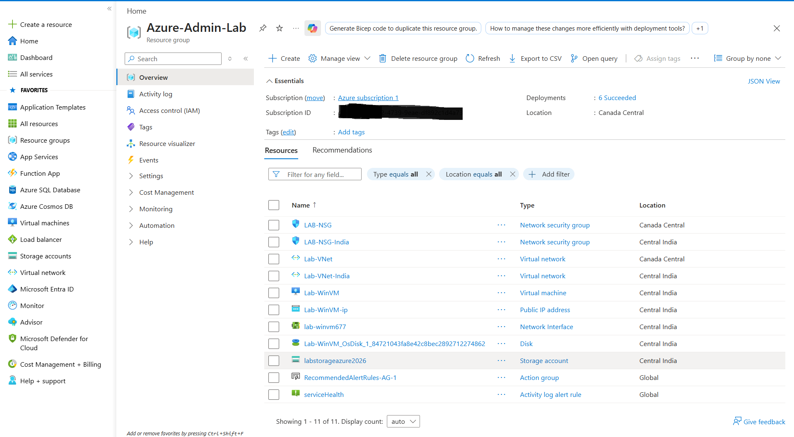

---

# 2. Azure Virtual Network

A Virtual Network named:

`Lab-VNet-India`

was configured in the Central India Azure region.

The Virtual Network used the following address space:

`10.1.0.0/16`

Azure Virtual Networks provide private networking for Azure resources such as virtual machines.

### Screenshot

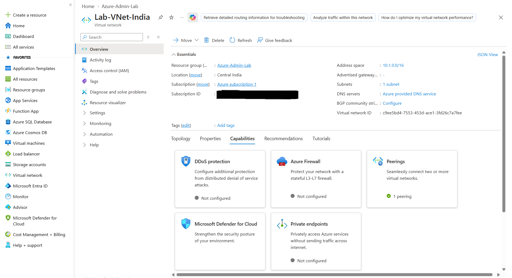

---

# 3. Azure Subnet

A subnet was created inside the Virtual Network.

Configuration:

- VNet Address Space: `10.1.0.0/16`
- Subnet Range: `10.1.0.0/24`

The Windows Server virtual machine was later deployed inside this subnet.

### Screenshot

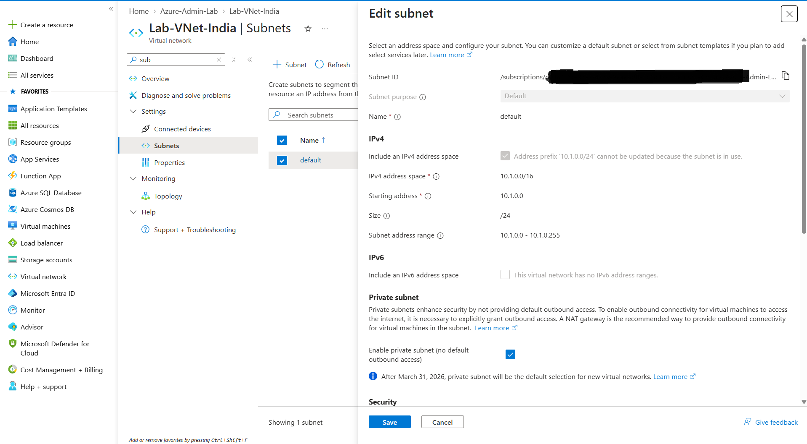

---

# 4. Network Security Group

A Network Security Group named:

`LAB-NSG-India`

was configured to control inbound and outbound network traffic.

Network Security Groups can filter traffic based on:

- Source
- Destination
- Protocol
- Source port
- Destination port
- Priority
- Allow or Deny action

NSGs are an important part of securing Azure network resources.

### Screenshot

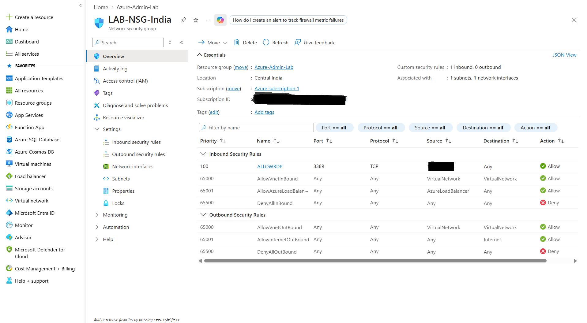

---

# 5. RDP Security Rule

Remote Desktop Protocol uses TCP port:

`3389`

During the lab, Remote Desktop access to the Windows Server VM initially failed because inbound RDP traffic was blocked.

A custom inbound rule named:

`ALLOWRDP`

was created.

Configuration:

```text
Protocol: TCP
Service: RDP
Destination Port: 3389
Action: Allow
Priority: 100
Source: Administrator Public IP
```

Instead of allowing RDP access from the entire Internet, the rule was restricted to the administrator's public IP address.

This provides better security by reducing unnecessary exposure of TCP port 3389.

### Screenshot

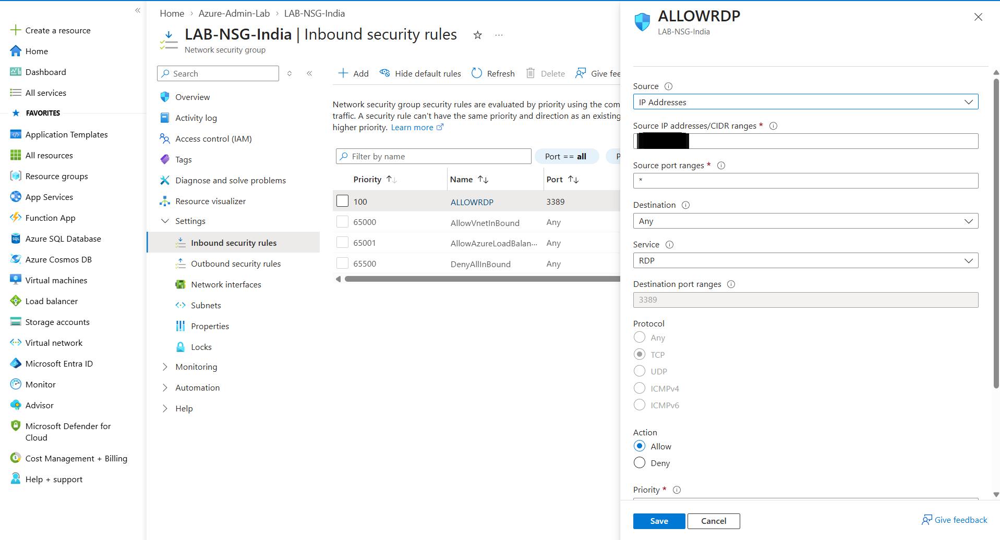

---

# 6. Windows Server Virtual Machine

A Windows Server virtual machine was deployed in Microsoft Azure.

Configuration included:

- VM Name: `Lab-WinVM`
- Operating System: Windows Server 2022 Datacenter
- Architecture: x64
- Region: Central India
- Virtual Network: `Lab-VNet-India`
- Private IP Address: `10.1.0.4`
- Public IP: Used for temporary lab RDP access
- OS Disk: Standard SSD
- VM Series: B-Series

A lower-cost virtual machine configuration was selected because this environment was created for learning and testing purposes.

### Screenshot

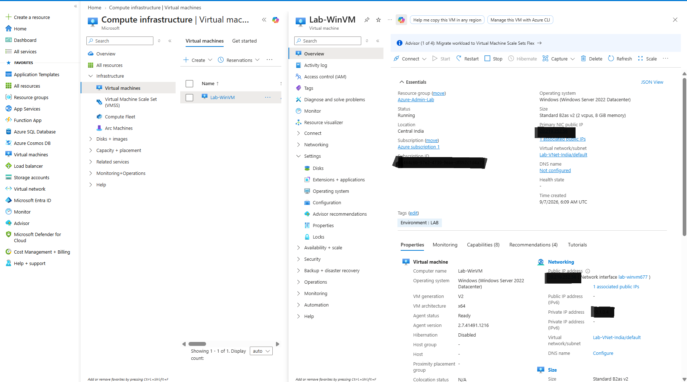

---

# 7. VM Network Configuration Verification

After successfully connecting to the Windows Server VM using Remote Desktop, the following command was executed:

```powershell
ipconfig
```

The network configuration showed:

```text
IPv4 Address: 10.1.0.4
Subnet Mask: 255.255.255.0
Default Gateway: 10.1.0.1
```

This confirmed that the virtual machine successfully received an IP address from the Azure subnet.

### Screenshot

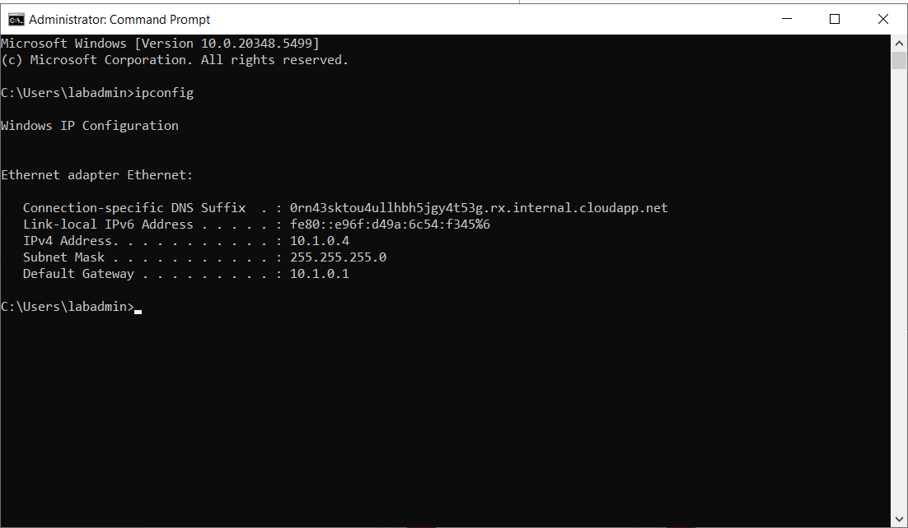

---

# 8. Azure VM Monitoring

Azure Monitor was used to review the performance and health of the virtual machine.

Metrics can include:

- CPU utilization
- VM availability
- Network traffic
- Disk activity
- Disk operations

Monitoring helps administrators identify performance problems and investigate abnormal system behavior.

### Screenshot

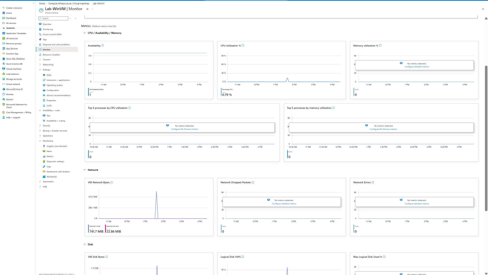

---

# 9. Azure Activity Log

The Azure Activity Log was reviewed to monitor administrative operations performed inside the Azure environment.

Examples of activities that can appear in the Activity Log include:

- Creating resources
- Updating resources
- Deleting resources
- Changing configurations
- Adding resource locks

Activity Logs can help administrators determine:

- What operation occurred
- When the operation occurred
- Whether it succeeded or failed
- Which resource was affected

This is useful for troubleshooting and auditing Azure environments.

### Screenshot

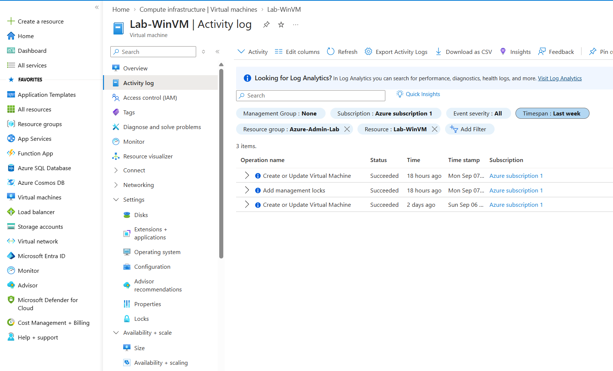

---

# 10. Azure Role-Based Access Control

Azure Access Control (IAM) was reviewed to understand Role-Based Access Control.

Azure RBAC allows administrators to control what users can do within Azure.

Common Azure roles include:

### Reader

Can view Azure resources but cannot modify them.

### Contributor

Can create and manage Azure resources but cannot assign Azure RBAC roles.

### Virtual Machine Contributor

Can manage virtual machines without receiving full permissions over the Azure subscription.

### Owner

Provides full management access and can assign Azure roles to other users.

RBAC is commonly used to implement the principle of least privilege.

### Screenshot

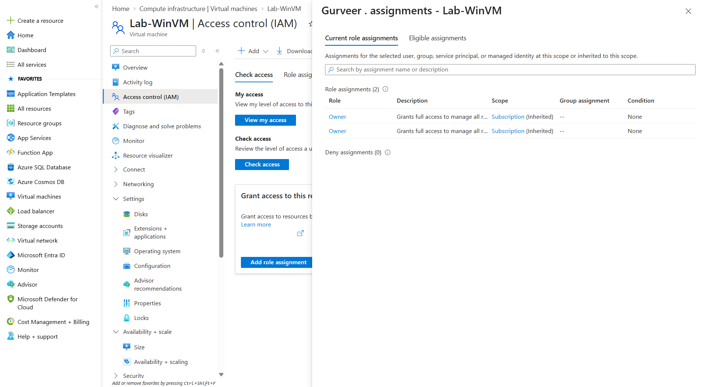

---

# 11. Azure Resource Tags

A resource tag was added to the virtual machine.

Example:

`Environment : LAB`

Azure tags can be used to organize resources by:

- Environment
- Project
- Department
- Application
- Owner
- Cost Center

Tags are also useful for reporting and cost management.

### Screenshot

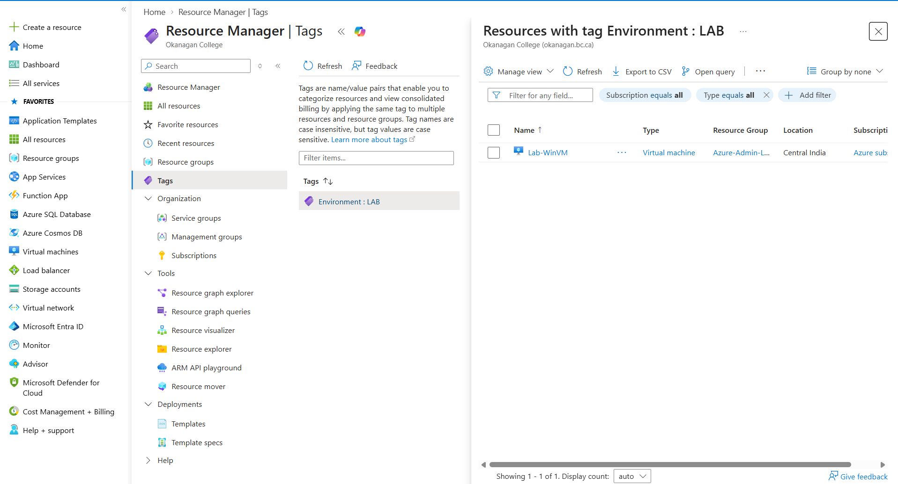

---

# 12. Azure Resource Lock

A Delete Lock was configured on the virtual machine.

Lock Name:

`Protect-LabVM`

Lock Type:

`Delete`

The Delete Lock prevents the protected Azure resource from being accidentally deleted.

Before intentionally deleting the resource, the administrator must first remove the lock.

### Screenshot

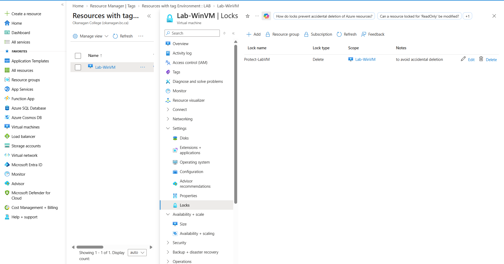

---

# 13. Azure Cost Management

Azure Cost Management was reviewed to understand and monitor Azure spending.

Topics reviewed included:

- Current spending
- Forecasted spending
- Resource costs
- Monthly budgets
- Cost alerts
- Cost optimization

Cloud administrators must monitor resource usage because active cloud resources can continue generating charges.

### Security Note

Sensitive subscription, billing, and account information should be hidden before screenshots are uploaded to a public GitHub repository.

### Screenshot

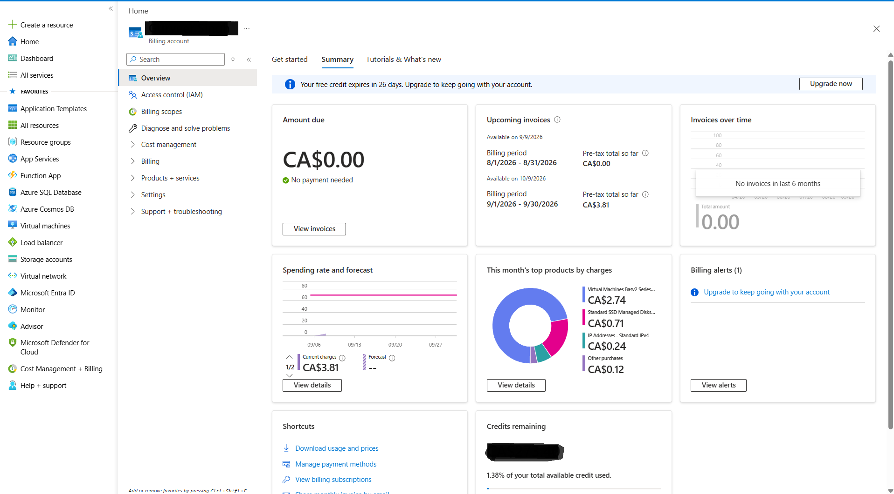

---

# 14. Azure Resource Visualizer

Azure Resource Visualizer was used to understand the relationships between Azure resources.

The visualizer can show connections between components such as:

- Virtual Machines
- Network Interfaces
- Public IP Addresses
- Virtual Networks
- Network Security Groups
- Managed Disks
- Storage Accounts
- Monitoring resources

This helps administrators understand dependencies inside an Azure environment.

### Screenshot

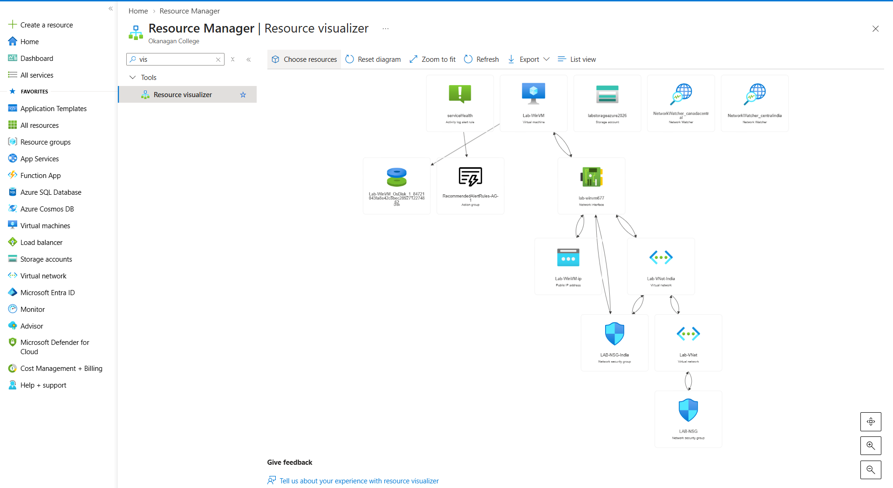

---

# 15. Azure Advisor

Azure Advisor was reviewed to examine recommendations provided by Microsoft Azure.

Azure Advisor can provide recommendations in areas such as:

- Cost
- Security
- Reliability
- Performance
- Operational Excellence

Not every recommendation needs to be implemented.

Recommendations should be evaluated according to:

- Business requirements
- Security requirements
- Performance requirements
- Budget
- Environment purpose

Because this was a temporary learning environment, some recommendations were not implemented to avoid unnecessary costs.

### Screenshot

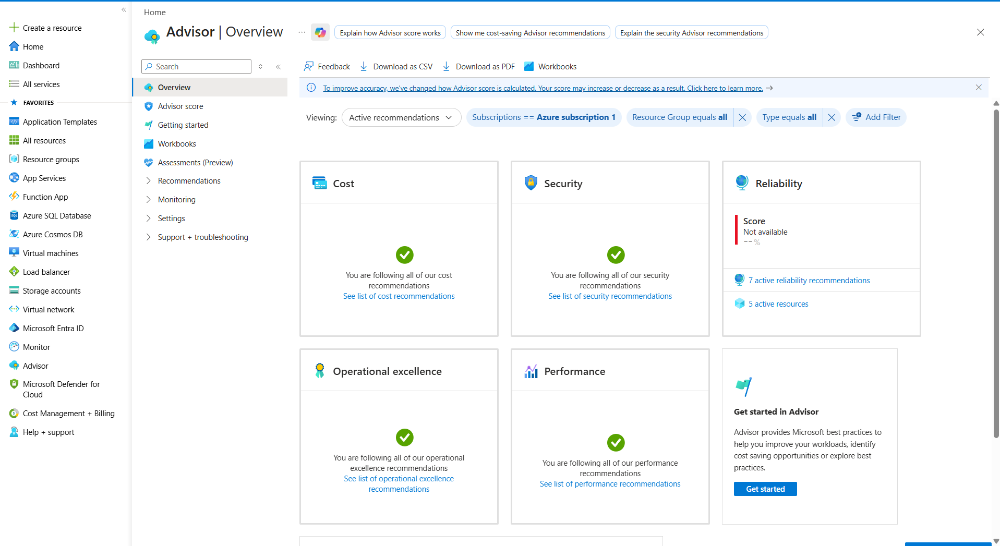

---

# 16. Azure Service Health

Azure Service Health was reviewed to understand how administrators can monitor problems affecting Microsoft Azure services.

Azure Service Health can provide information about:

- Azure service incidents
- Planned maintenance
- Health advisories
- Service disruptions

A Service Health alert was also configured.

This allows administrators to receive notifications when Azure services experience important issues.

### Screenshot

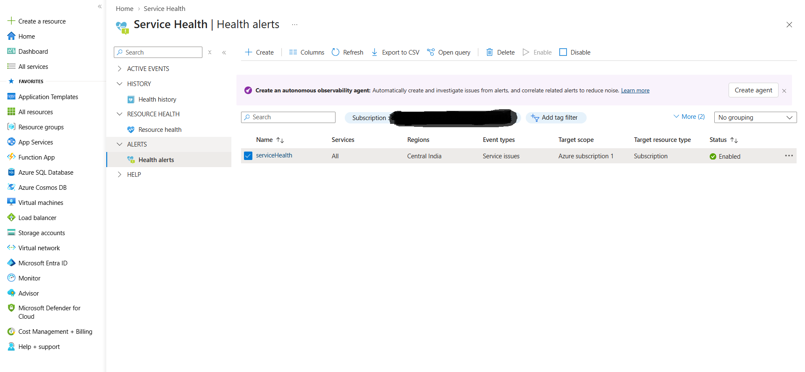

---

# 17. Azure Storage Account

An Azure Storage Account was created during the lab.

Storage configuration included:

- Standard performance
- Locally Redundant Storage
- Secure transfer enabled
- TLS 1.2
- Microsoft-managed encryption
- Anonymous Blob access disabled

Locally Redundant Storage was appropriate for this temporary lab because it provides a lower-cost storage option.

### Screenshot

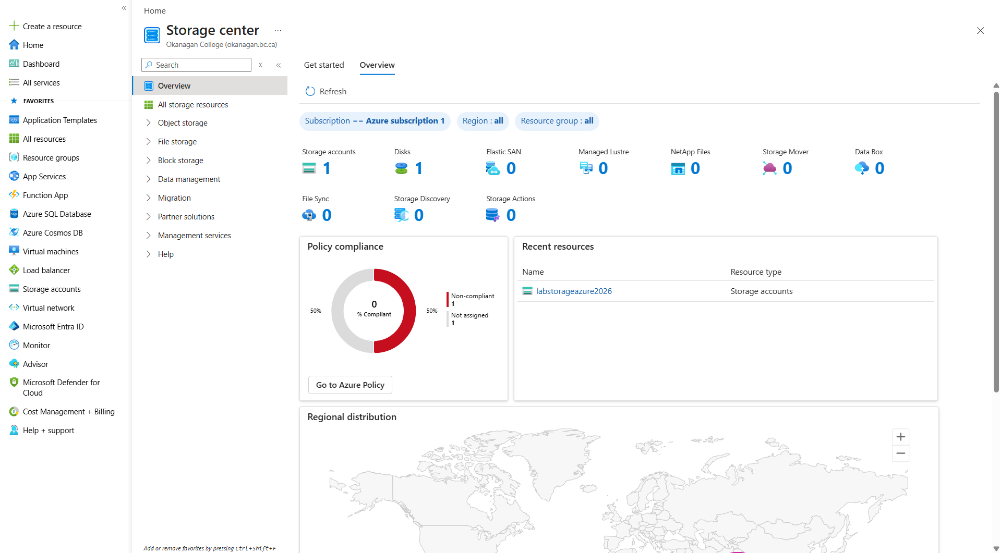

---

# 18. Azure Blob Storage

A Blob Storage container named:

`labcontainer`

was created inside the Azure Storage Account.

A test file was uploaded into the container.

Azure Blob Storage follows a structure similar to:

```text
Storage Account
      |
      +-- Container
             |
             +-- Blob/File
```

Example:

```text
Storage Account
      |
      +-- labcontainer
             |
             +-- azure-test.txt
```

Azure Blob Storage can be used for:

- Documents
- Images
- Videos
- Application files
- Backups
- Archives
- Log files
- Large datasets

### Screenshot

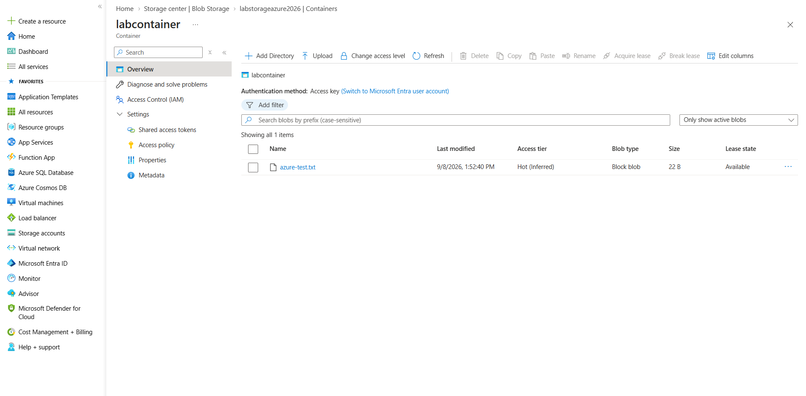

---

# 19. Shared Access Signature

The Blob Storage container was kept private instead of allowing anonymous public access.

A Shared Access Signature was used to understand how temporary access can be provided to Azure Storage resources.

A SAS can provide:

- Temporary access
- Limited permissions
- Expiration times
- HTTPS access
- Controlled access to private resources

SAS tokens should be treated like temporary credentials.

They should never be uploaded to a public GitHub repository.

The actual SAS token used during the lab is therefore not included in this documentation.

---

# 20. Azure VNet Peering

Two Azure Virtual Networks were connected using VNet Peering.

The environments included:

## Canada Central

```text
Virtual Network: Lab-VNet
Address Space: 10.0.0.0/16
```

## Central India

```text
Virtual Network: Lab-VNet-India
Address Space: 10.1.0.0/16
```

The networks used different and non-overlapping IP address ranges.

The peering showed a connected and synchronized status.

Because the Virtual Networks were located in different Azure regions, this demonstrated Global VNet Peering.

Global VNet Peering allows Azure resources located in different regions to communicate privately through Microsoft's network infrastructure.

### Screenshot

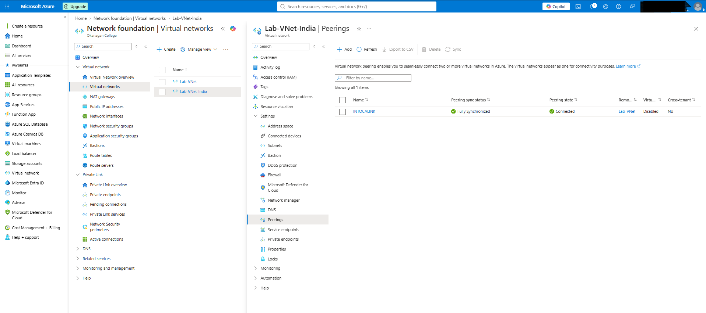

---

# Troubleshooting Scenario

## RDP Connection Failure

One of the troubleshooting exercises completed during the project involved Remote Desktop connectivity.

Initially, the Windows Server VM could not be reached using RDP.

The connection was being blocked because TCP port:

`3389`

was not allowed through the Network Security Group.

The default Azure NSG behavior was denying the inbound traffic.

## Resolution

A custom inbound rule was created:

```text
Rule Name: ALLOWRDP
Protocol: TCP
Destination Port: 3389
Source: Administrator Public IP
Action: Allow
Priority: 100
```

After applying the rule, the Windows Server VM became accessible through Remote Desktop.

This troubleshooting exercise demonstrated how Network Security Groups affect Azure VM connectivity.

---

# Security Practices Demonstrated

Several security practices were followed during the project.

## Restricted RDP Access

TCP port `3389` was restricted to the administrator's public IP instead of being opened to everyone.

## Network Security Groups

NSGs were used to control inbound and outbound network traffic.

## Private Blob Storage

Anonymous public access to Blob Storage was disabled.

## Shared Access Signature

Temporary delegated access was practiced using SAS instead of making the container publicly accessible.

## Secure Storage Communication

Secure transfer and TLS were enabled for the Azure Storage Account.

## Azure RBAC

IAM roles were reviewed to understand least-privilege access.

## Resource Locks

A Delete Lock was used to protect an important resource against accidental deletion.

## Protection of Sensitive Information

Sensitive information should not be published in a public repository, including:

- Passwords
- SAS tokens
- Authentication secrets
- Subscription identifiers
- Billing information
- Personal information

---

# Cost Optimization

Because this environment was created for learning purposes, cost control was considered throughout the project.

Cost-saving practices included:

- Using a smaller B-Series VM
- Using Standard SSD storage
- Using Standard LRS storage
- Avoiding unnecessary additional disks
- Avoiding unnecessary premium services
- Reviewing Azure Advisor recommendations before implementing them
- Monitoring Azure Cost Management
- Creating budget alerts
- Stopping and deallocating virtual machines when not required

When an Azure VM is not being used, it should be stopped until its status shows:

`Stopped (deallocated)`

This prevents continued VM compute charges while the machine is deallocated.

Storage and some other attached Azure resources may still generate charges.

---

# Skills Demonstrated

This project demonstrates practical experience with:

- Microsoft Azure Administration
- Azure Resource Groups
- Azure Virtual Networks
- IPv4 Networking
- Subnetting
- Network Security Groups
- Windows Server Deployment
- Remote Desktop Administration
- Azure Networking Troubleshooting
- Azure Monitor
- Azure Activity Logs
- Azure IAM
- Azure RBAC
- Resource Tags
- Resource Locks
- Azure Cost Management
- Azure Advisor
- Azure Service Health
- Azure Storage Accounts
- Azure Blob Storage
- Shared Access Signatures
- VNet Peering
- Global Azure Networking
- Azure Security Fundamentals
- Cloud Cost Optimization

---

# Key Takeaways

This lab provided hands-on experience creating and administering a Microsoft Azure environment.

The overall workflow included:

```text
Resource Group
      |
      v
Virtual Network
      |
      v
Subnet
      |
      v
Network Security Group
      |
      v
Windows Server VM
      |
      v
Remote Desktop
      |
      v
Monitoring
      |
      v
Activity Logs
      |
      v
RBAC
      |
      v
Resource Protection
      |
      v
Cost Management
      |
      v
Storage
      |
      v
VNet Peering
```

The project demonstrated that Azure administration involves more than simply creating cloud resources.

Administrators must also consider:

- Security
- Networking
- Permissions
- Monitoring
- Troubleshooting
- Cost
- Storage
- Resource organization
- Availability

---

# Cleanup

After completing the lab, unused Azure resources should be stopped or deleted to prevent unnecessary charges.

Recommended cleanup steps:

1. Stop and deallocate the Windows Server VM.
2. Remove the Delete Lock before attempting to delete the protected VM.
3. Delete unused Public IP resources.
4. Delete unused Network Interfaces.
5. Delete unused Managed Disks.
6. Delete temporary Storage resources when no longer required.
7. Remove VNet Peering if no longer required.
8. Delete the Resource Group after completing all lab documentation.

---

# Project Status

**Completed**

This project was created as part of hands-on practice with Microsoft Azure administration, cloud networking, Windows Server, security, monitoring, storage, access control, troubleshooting, and cost management.
